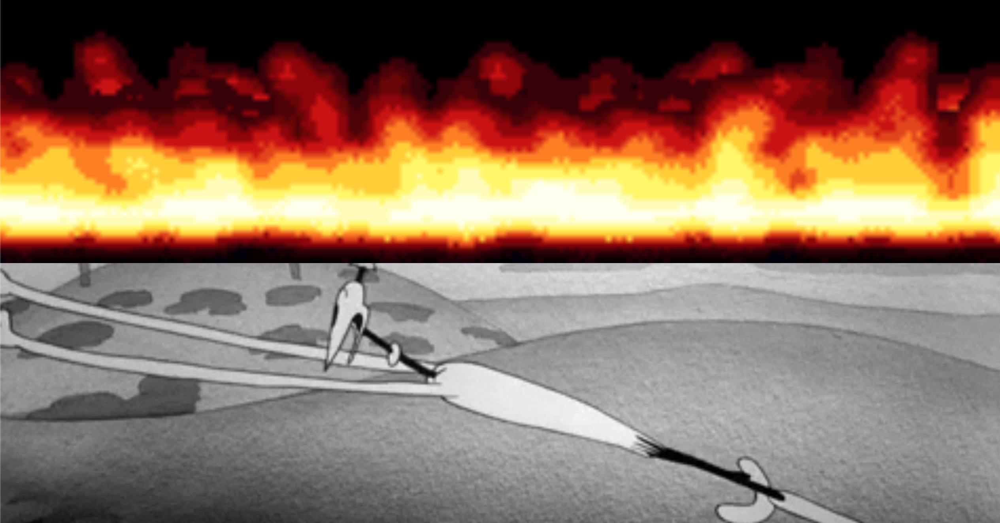

This project was tasked to us by <http://u-p.co> (Uriah) during the unit Digital Publishing. You can see the project brief at <http://dpub.u-p.co/projects/geoflag-brief>.

TLDR; The world and the way we interact with it can be split up into several layers of a stack. This is similar to the way the internet can also be split up into the information stack. We took the facets of life that correspond to the stack and made some abstract flags about each layer. These flags were then compiled into an auto generated flag by Uriah. Which can be seen at <https://uriahgray1.github.io/flag/>.

You can see all the flags I created at <https://dpub.bailouni.com/geo-graphics/index.html>, these include flags such as:

